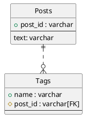

# DB設計のアンチパターン１

## 課題1

- 特定のタグを持つデータを検索するときに、パターンマッチを使わないといけなくなる
- 集約クエリが煩雑になる
- VARCHAR型の文字数制限によって格納できるタグの数が制限される
- タグ名に区切り文字と同じ文字（今回の場合だとカンマ）が使われた場合、意図しない挙動を起こす

## 課題1

従属テーブルを作る

```plantuml
	
@startuml

hide circle

entity "Posts" as post {
  + post_id : varchar
  --
  text: varchar
}

entity "Tags" as e02 {
  + name : varchar
  # post_id : varchar[FK]
  --
}


post ||..o{ e02

@enduml

```
